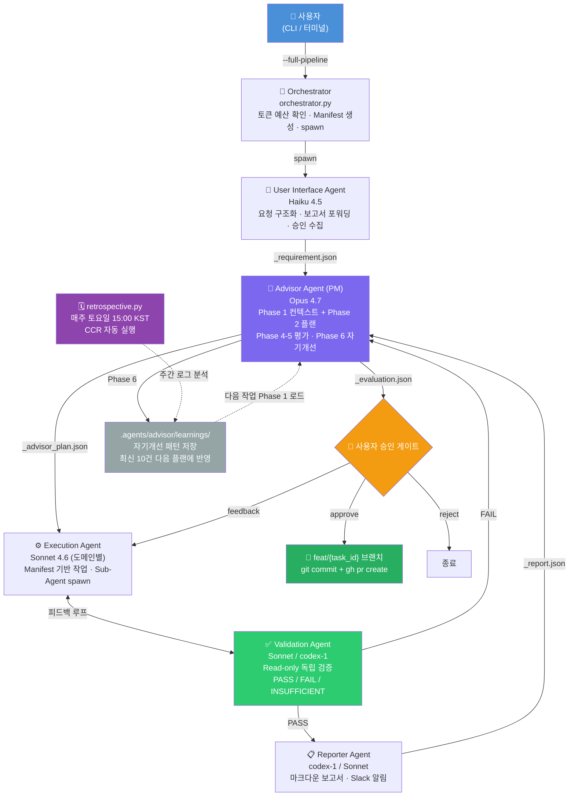
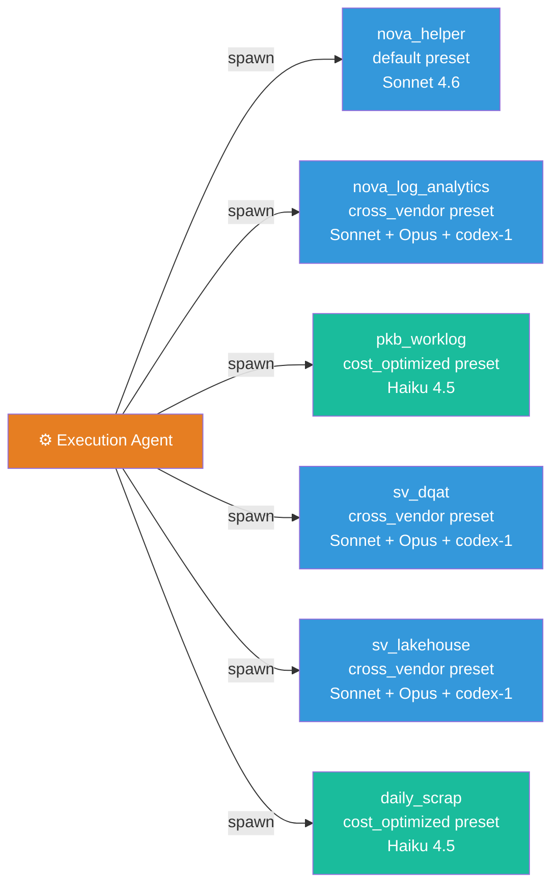
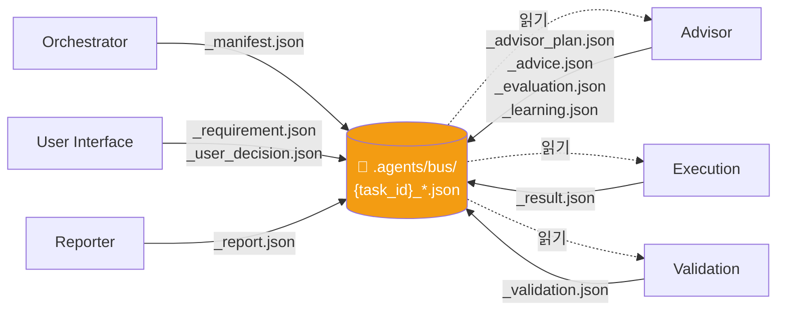
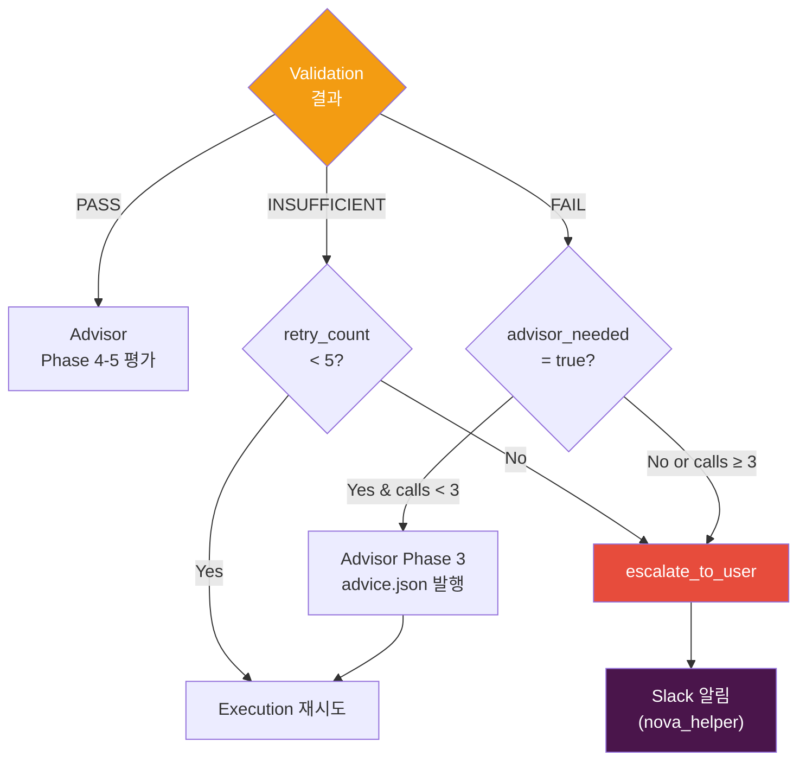
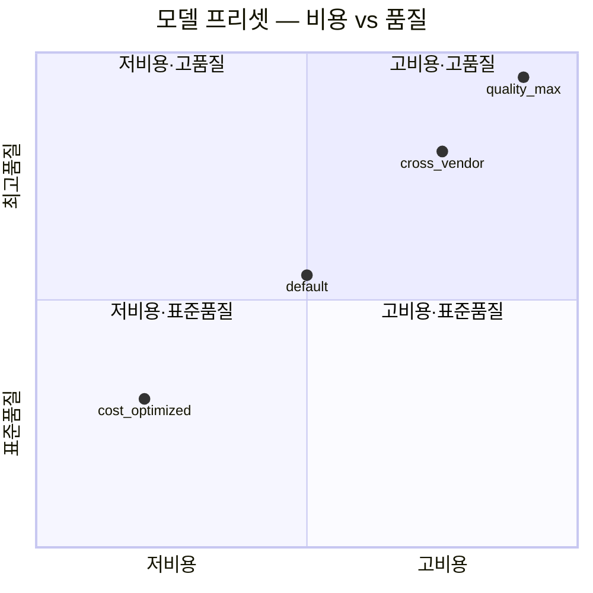

# Agent Ecosystem — 구조도 (Mermaid)

> GitHub에서 렌더링 확인용. ASCII 버전 → [ARCHITECTURE_MAP.md](ARCHITECTURE_MAP.md)

---

## Full Pipeline (v2.0)

---

## Domain Sub-Agent 레이어

---

## Agent Bus 통신 흐름

---

## 에스컬레이션 정책

---

## 모델 프리셋 비교

